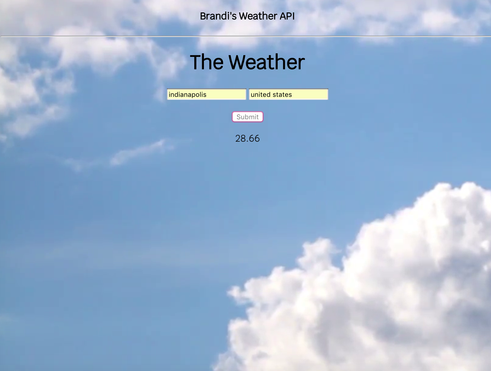

Tech Used: Html, Css, API

My goal while doing this project, was to better understand how APIs work.
I was able to provide forecast data for my applications using an API.

What I learned is an API is a set of clearly defined methods of communication among various components.
